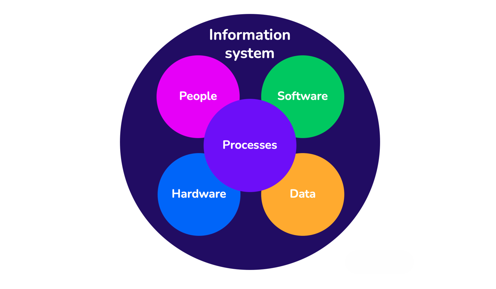

# Information Systems - Business Process Reengineering & IT Strategy

## Description
A comprehensive enterprise architecture and IT alignment project developed for the **Information Systems** course during my Master's Degree in Computer Engineering at **Politecnico di Torino**. This case study focuses on Associazione Culturale Pandora, an organization hosting an international improv theatre festival. The project encompasses a full AS-IS analysis of their manual operations and designs a TO-BE IT strategy, proposing a custom optimization solver to automate their complex accommodation logistics, backed by rigorous financial and risk management planning.

## Core Competencies & Analysis Areas

* **Enterprise AS-IS Analysis:** Modeled the organizational structure, Business Model Canvas, and current IT deployment (relying on fragmented tools like Google Sheets, WordPress, and WhatsApp). Identified critical bottlenecks in the manual "Accommodation organization" process, which previously consumed over 35 hours and incurred unnecessary expenses from unutilized or last-minute extra rooms.
* **Business Process Modeling (BPMN):** Mapped workflows for both AS-IS and TO-BE scenarios using standard BPMN notation. Supported process documentation with Conceptual Data Models and Hardware/Software Deployment Diagrams to visualize the architectural shift.
* **IT Strategy & Vendor Selection:** Proposed upgrading from manual spreadsheets to an automated mathematical optimization engine interacting seamlessly with the Google Sheets API. Conducted a Multi-Criteria Decision Analysis (MCDA) evaluating solvers like HiGHS, CBC, and Gurobi, ultimately selecting the open-source CBC solver to eliminate licensing fees while meeting technical requirements.
* **Financial Evaluation (TCO & ROI):** Developed a 5-year financial projection for the proposed solution, estimating a Total Cost of Ownership (TCO) of 5,600 € against cumulative savings of 8,000 € derived from optimized room usage and reduced manual effort. Calculated a robust Return on Investment (ROI) of 42.9%, reaching the break-even point in the fourth year of operation.
* **Change Management & Risk Mitigation:** Classified the implementation as a first-order change and developed a management plan to address user adoption barriers and software obsolescence risks. Recommended formalizing operational procedures and strictly capping training requirements to under 10 minutes to ensure seamless onboarding.

## Frameworks & Tools

* **Methodologies:** Business Process Reengineering (BPR), Multi-Criteria Decision Analysis (MCDA), TCO & ROI Financial Modeling.
* **Modeling:** BPMN, UML (Deployment Diagrams, Entity-Relationship Data Models).
* **Proposed Architecture:** Open-source CBC optimization solver, Google Sheets API integration.

## Members

| Surname | Name     | Matricola |
|:--------|:---------|:----------|
| Ferrero | Gabriele |  S358479  |
| Ferrone | Luca     |  S358462  |
| Tallone | Stefano  |  S358440  |
| Vivante | Nicola   |  S358312  |