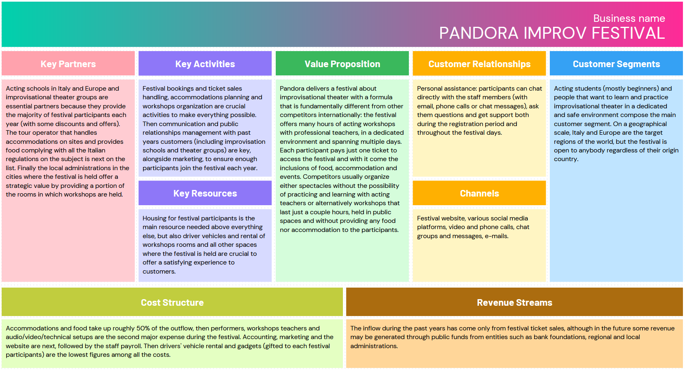
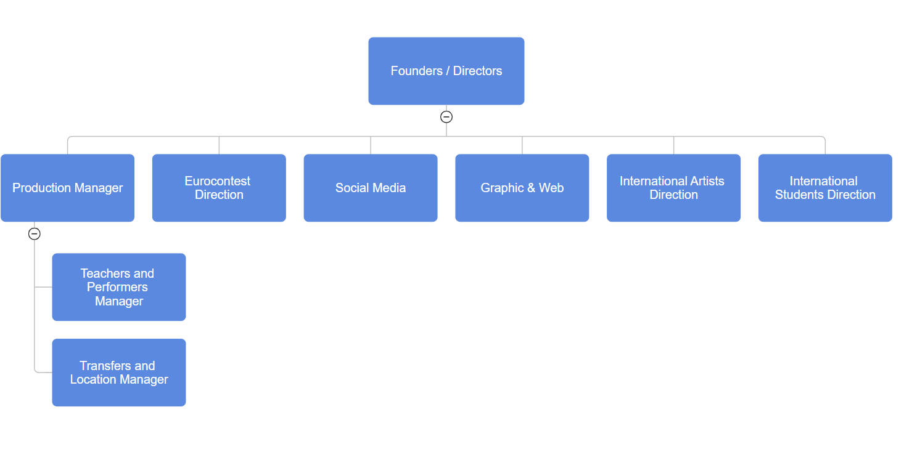
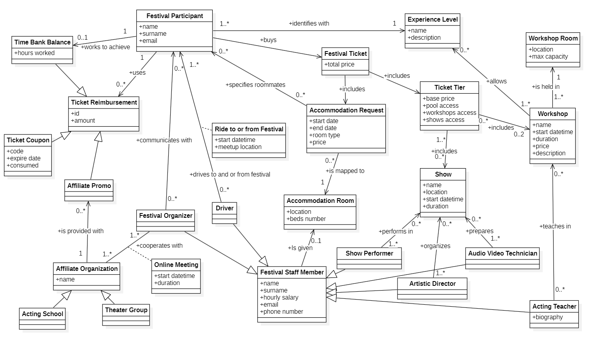
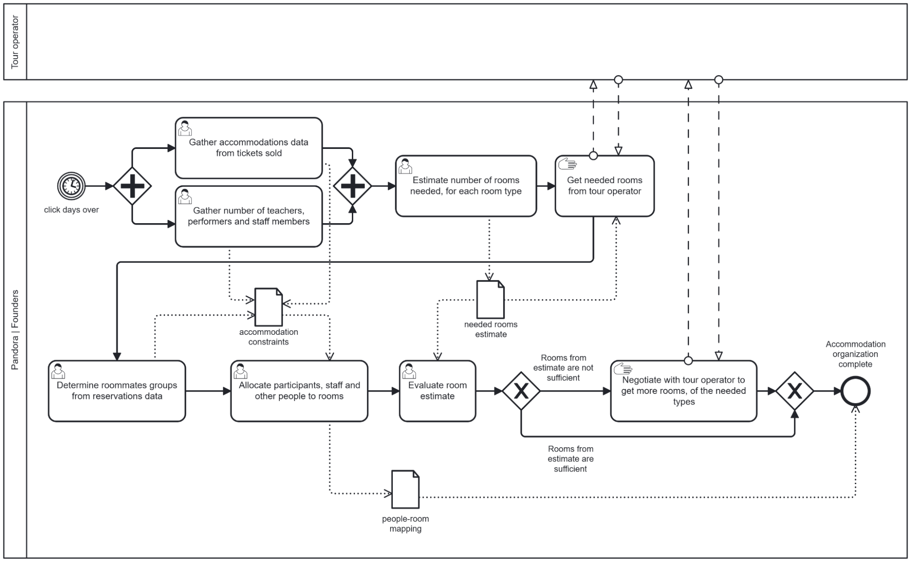
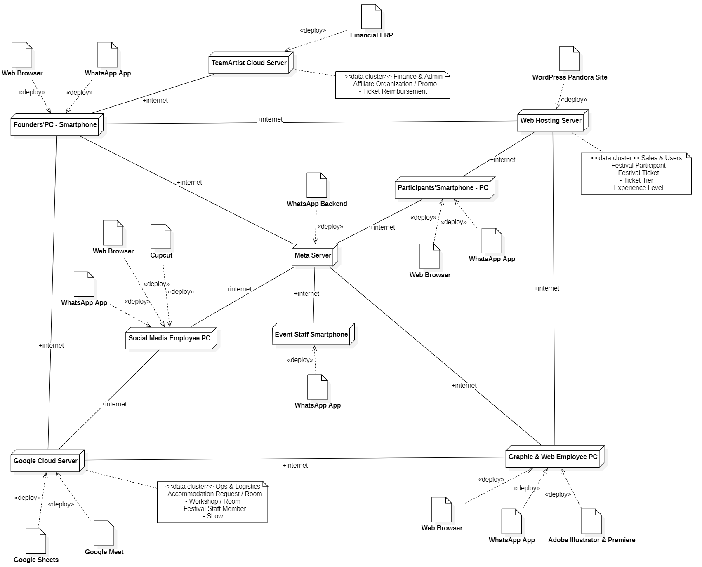

# Model of Organization – as is

# Identification

Associazione Culturale Pandora, Corso Principe Oddone 14, 10122, Torino

CF 91119620333

Ateco or NACE code and category

ATECO Code 2007/2025: 94.99.20: Activities of cultural and recreational associations

# Financial and legal information

Pandora is categorized as APS (Associazione di Promozione Sociale), so there are no commercial activities by which the organization directly produces revenue. The only inflow sources of Pandora are:

- Member participation fees (each participant to the festival must be a member of the association to take part in association activities, which happen during the festival itself)
- Public funds from entities such as bank foundations, regional and local administrations

Turn over of 2025: 240.000 €

# Business Model Canvas

# IS Dimensions

According to the definition of Piccoli and Pigni, an IS has four dimensions. In the following they are described under sections Social system (Structure and People), Process, Technology.

## Social system

### Size

Pandora does not formally track the exact number of hours worked by each team member, as employees are evaluated based on completed tasks and operational outcomes rather than on hourly attendance. 

During the first phase of the year, the organization operates with a very small core team composed of three people working approximately 5–6 hours per week each. At this stage, the workload is limited and mainly focused on planning and coordination activities.

Starting from November, additional operational roles are introduced. A graphic designer begins working for approximately 3–4 days in total, while the Social Media Manager (SMM) starts producing initial promotional content and managing early communication activities.

From February onward, the workload significantly increases. The management team becomes more actively involved, working at least two days per week on a part-time basis. At the same time, two new roles are added: a Logistics Manager and a Production Director. Weekly coordination meetings are also introduced in order to support the growing operational complexity.

Beginning in June, the organization reaches its peak activity period. The entire staff works full-time for approximately eight working days, with all members involved throughout the day to support production, logistics, communication, and event-related operations.

### Products, services

Pandora delivers a fully organized festival about improvisational theater, complete with accommodations, food and workshops with both local and international teachers.

### Goal, goal type, mission, vision, strategy

As declared by the organization the goal is to become a European point of reference for improvisational theatre.

Their mission is to safeguard and promote the cultural heritage of this type of theatre by providing an inclusive and safe environment. Pandora aims to empower individuals of all backgrounds and abilities (including those with disabilities) to express themselves freely through high-quality artistic training and performance.

To achieve the long-term vision, Pandora implements an “All-inclusive” strategy that differs from the standard European festival circuit: 

- **Integrated value proposition**: Unlike competitors who sell workshops, accommodations, and tickets separately, Pandora provides a single “Village” package. This includes accommodations, full board, intensive workshops (9-11 hours), evening shows, and side events (themed parties, concerts and interviews).
- **The school partnership program**: Pandora operates a growth model where improv  schools act as partners. By incentivizing schools to bring groups of students (offering rewards such as free access or expense reimbursements), they aim to accelerate Italian and international enrollment.
- **Immersion**: By hosting the festival in a dedicated environment, Pandora trades mass capacity for an intensive, high-impact experience. This fosters a highly loyal client base. 
- **Competitive pricing**: Pandora utilizes local agreements and volume-based lodging to offer a premium experience at a more accessible price point than European festivals.

Organisation’s motto: Eat - Sleep - Improv - Repeat 

### Culture

The organizational culture of Pandora is strongly characterized by:
- **Relational and personal orientation**: Marketing, customer management, and internal coordination all prioritize direct human relationships over automated or impersonal processes. The founders deliberately maintain personal contact with every participant.
- **Community identity**: The festival positions itself as a "village" — a temporary but deeply bonded community. Repeat attendance is very high, and the school partnership model reinforces loyalty bonds on both sides.
- **Informality and flexibility**: Internal operations rely on accumulated habits and shared knowledge among the founding team rather than formalized procedures. This is both a strength (agility, personal judgment) and a recognized weakness (knowledge concentration, scalability risk).
- **Experimentation and openness**: In line with the values of improv theater itself, the organization continuously experiments — whether with new event formats, new audience segments (e.g., "novices"), or new partnerships (e.g., LARP). Feedback from participants is actively collected and analyzed.
Responsible inclusivity: Diversity and inclusion are not only values but operational commitments. The festival explicitly accommodates participants with physical disabilities and promotes freedom of expression regardless of background

### Structure

The organization exhibits a <u>functional</u> structure, each role covers a distinct operational domain (artistic, logistical, technical, administrative, marketing).
There is no divisional or geographical subdivision, as the entire festival takes place in a single location.

#### IT/IS group / office

Pandora operates without a centralized IT department, utilizing a hybrid management model that combines external expertise with internal coordination: 
- **Website and online registration**: Managed by a single dedicated contributor who is primarily a graphic designer with no coding skills. The website is built on WordPress, which makes implementing changes and custom features more complex and less flexible. His role is mainly active from October onward, focusing on marketing and visual updates to the site, and then transitions into a support role during the registration period.
- **APS management software**: Provided by Team Artist, a specialized accounting firm for APS/ETS entities. This platform handles member registration, compliance, communication logging, and billing in accordance with Italian Third Sector regulations.
- **Infrastructure**: The organization maintains no physical servers or local hardware infrastructure. 
 
IT expenditure for 2025 was 4.000€.

$ \frac{expense \ in \ IT}{turn \ over} = \frac{4.000 €}{240.000 €} = 1.66 \ \% $

### Formalization / specialization/ centralization

The organization can be described as a normative organization with a flat structure and elements of a centralized bureaucracy, combined with a low level of formalization and high specialization.

### Organizational type

The organization can be described as Entrepreneurial: it is flexible and focused on organizing the event, with the main strategic and operative decisions being taken by the founders.

Teams are formed around a specific event (the festival), with roles that can change depending on needs. 

There is a low level of formalization and a high level of collaboration, allowing quick decisions and adaptability. This structure supports creativity and rapid problem-solving, which are essential for managing live events and generating revenue from ticket sales.

## Process dimension

### Conceptual data model

### Processes

List and describe key processes

| Process name | Description (text) | Input | Output | Organizational units involved |
| :--- | :--- | :--- | :--- | :--- |
| PR with schools and theatre groups | Outreach to Italian and European improv theatre schools and groups to establish partnerships and confirm group participation for the current festival edition. | Email from Pandora (founders' personalized outreach) | List of confirmed theatre partners with negotiated terms for the current event | Founders |
| Accommodations organization | Planning and booking of accommodation capacity based on the expected total guest count. Includes room type negotiation and adjustments for post-booking changes or shortages. | Estimate of guest count (staff, teachers, performers, and festival registrants), booking preferences | Reservations for required rooms confirmed | Founders |
| Performers and workshop teachers coordination | Identification, selection, and contracting of performers and workshop teachers for the festival. | Request for collaboration during festival | Contract stipulated between collaborator and Pandora | International Artists Direction, Teachers and Performers Manager |
| Workshop rooms organization | Assignment of workshops to available classrooms across school buildings and the festival village, balancing participant counts, experience levels, language, and acoustic constraints between adjacent rooms. | List of workshops and number of participants per workshop | Workshop schedule with classroom assignments | Teachers and Performers Manager |
| Customer help and communication | Handling of participant inquiries and support requests before, during, and after the festival. | Participant inquiry or support request | Resolved inquiry; information provided to participant | International Students Direction |

#### BPMN - Process “Accommodations organizations”

## Technology dimension

### Application portfolio

| Application name | Vendor | Main functions |
| --- | --- | --- |
| Google Meet | Google | Host and record organization meetings.|
| Google Sheets | Google | Used to manage most organizational activities. |
| Website | Internal | Used to sell tickets for the festival and to let the public know what Pandora and the festival are about. Made with Wordpress. |
| Financial ERP for cultural associations | TeamArtist | Manage financial activities. |
| Whatsapp | Meta | Communications with staff. Broadcast communication with customers. |
| Adobe Illustrator | Adobe | Make graphics. |
| Adobe Premiere | Adobe | Edit videos. |
| Cupcut | ByteDance | Edit videos for reels. |

### Hardware software architecture

### IT strategy

The organization does not have a dedicated IT department or a formal IT strategy. IT activities are limited mainly to the management of the association’s website, which is handled by a single employee. However, this employee is not an IT specialist but a graphic designer, meaning their skills are focused more on visual communication than on technical infrastructure or system management.

Because of this, the organization lacks the technical expertise needed to manage more complex situations, such as website failures caused by a high number of users trying to buy tickets at the same time. The current IT approach is therefore basic and operational, aimed only at maintaining an online presence and supporting essential activities.

This strategy is generally consistent with the organization’s overall strategy, since it allows the association to reduce costs and keep its structure simple. However, relying on one non-specialized employee creates limitations and risks, especially regarding scalability, reliability, and the management of technical problems.

Overall, the current IT strategy is coherent with the company strategy in terms of cost containment and simplicity, but it may not be sufficient if the organization’s digital needs grow in the future.

# Indicators

## CSF

| CSF ID | Scope | Type | Name | Description|
| --- | --- | --- | --- | --- |
| 1 | Organizational | Distinguishing | Quality of the experience | Providing a smooth and enjoyable experience from registration to event participation. The core differentiation from other European improv festivals is the immersive, all-inclusive village model. | 
| 1.1 | Functional | Domain | Effective Accommodation Coordination | Capability to organize accommodations for all festival participants and staff. |
| 1.2 | Functional | Domain | High-Quality Workshop Organization | Ensuring workshops are well planned, coordinated and delivered with qualified instructors and proper scheduling. |
| 2 | Functional | Domain | Efficient Booking and Ticket Management | Ability to manage reservations, ticket sales, participant registrations and attendance  efficiently and without errors. |
| 3 | Organizational | Distinguishing | Strong Customer Relationship Management | Maintaining continuous communication with past participants, improvisation schools and theater groups. |
| 3.1 | Functional | Distinguishing | Effective communication with participants | Ensuring key communications are delivered to all festival participants and relevant questions / support requests are handled rapidly. |
| 3.2 | Functional | Domain | Effective Marketing and Promotion | Ability to attract enough participants through marketing campaigns, social media presence and partnerships. |

 

## KPI
TO DO : chiedere a mauro i valori dei kpi e inserire i kpi nella tabella
### Process X

(Process name must be consistent with Process dimension)

KPI table for process X

| KPI name | KPI type (general, service..) | description | Unit of measure | CSF covered (if any) | Current value (if available) |
| --- | --- | --- | --- | --- | --- |
| ||||||

### Process Y

To be repeated for each relevant process (notably processes that will be changed in To Be)

# Summary analysis

The organization shows several critical points related to the management of information and operational processes.

Although Pandora has experienced significant growth in terms of participants, activities, and organizational complexity, most processes are still managed manually and without the support of appropriate Information Systems. In practice, a large part of the event organization relies on shared Google Sheets, WhatsApp messages, and informal coordination between team members.

This approach creates multiple organizational and IS-related issues:
- **Information fragmentation**: data regarding participants, accommodations, workshops, schedules, and logistics are distributed across multiple spreadsheets and communication channels, increasing the risk of inconsistencies and errors.
- **Lack of process integration**: the different organizational activities are not supported by a centralized system, meaning that updates in one area often need to be manually replicated in others.
- **High dependency on individuals**: much of the operational knowledge is concentrated in the founders and a few collaborators. Since procedures are poorly formalized, the organization strongly depends on personal experience and manual coordination.
- **Scalability limitations**: the current management model works only because of the relatively small size of the organization. As the festival grows, manually managing bookings, workshops, accommodations, and participant communication becomes increasingly difficult and inefficient.
- **Operational risk**: the absence of dedicated IT competencies creates vulnerabilities in the management of technical problems, especially during critical moments such as ticket sales or participant registration peaks. 

From an IT alignment perspective, the organization demonstrates a partial misalignment between business growth objectives and IT capabilities. Pandora aims to become a European reference point for improvisational theatre festivals, but its current IS infrastructure is still extremely basic and mostly operational. 

The current IT strategy is mainly focused on cost reduction and simplicity rather than process optimization or scalability. Moreover, website and digital activities are managed by a graphic designer rather than an IT specialist, limiting the organization’s ability to handle complex technical situations or develop more advanced digital solutions. 

Overall, the main alignment problem is that the organization’s strategic ambition and operational complexity are growing faster than its Information Systems maturity. Introducing more integrated and structured IS solutions could improve coordination, reduce manual work, increase reliability, and support future scalability of the festival.