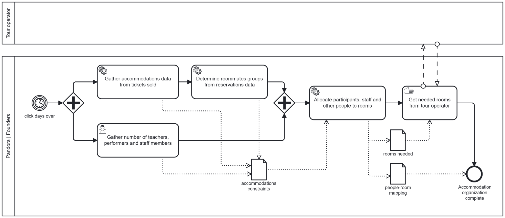
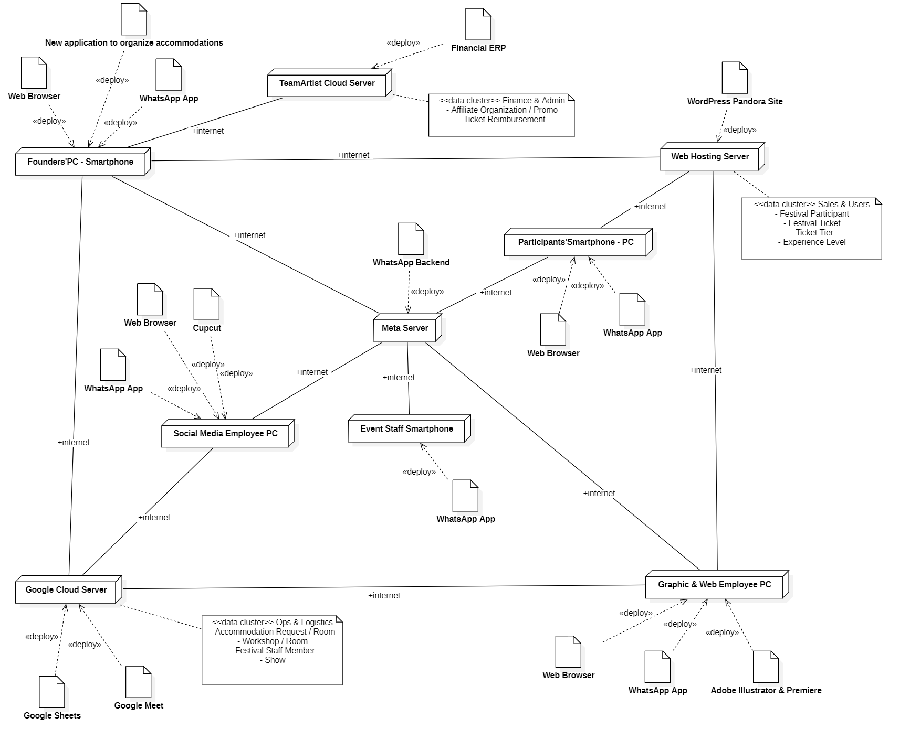

# Model of Organization – TO BE

# Contents
- [Summary of changes](#summary-of-changes)
  - [Process "Accomodation organization"](#process-accommodation-organization)
  - [Process "Customer help and communication"](#process-customer-help-and-communication)
- [Business Model Canvas](#business-model-canvas)
- [IS Dimensions](#is-dimensions)
- [Effect of change(s)](#effect-of-changes)
  - [Effect on KPIs and CSFs](#effect-on-kpis-and-csfs)
  - [TCO, ROI and Break even](#tco-roi-and-break-even)
    - [Cost elements (worst case)](#cost-elements-worst-case)
    - [Break even point analysis](#break-even-point-analysis)
      - [Estimate costs over 5 years period (worst case)](#estimate-costs-over-5-years-period-worst-case)
      - [Estimate cost savings over 5 years (worst case)](#estimate-costs-savings-over-5-years-worst-case)
      - [Break even point](#break-even-point)
    - [ROI](#roi)
- [Change management plan](#change-management-plan)
- [Conclusion](#conclusion)

# Summary of changes

Two organizational processes that should receive changes have been identified, and their potential changes are listed below:

### Process “Accommodation organization”
The change aims to completely automate the mapping process between accommodation requests from festival participants to actual rooms  with the use of a software algorithm, trying to satisfy the maximum number of roommates specification requests while aiming at minimizing the number (and therefore cost) of needed rooms. This would allow the process to take less time to complete overall, and more importantly it could result in considerable budget savings, given the fact that accommodations cost figures at the top spot of yearly expenses.

This is a first order change, and while there is the possibility that the human-performed allocation of the As Is process is already optimal (so a software alternative to compute room allocation wouldn’t provide that much savings), that is unlikely given the increasing number of participants each year. Also the organization will benefit from the timesave anyways.

### Process “Customer help and communication”
The change to this process consists in the deployment of a dedicated mobile application to handle communications with festival participants, such as providing answers to questions, sharing important info about the workshops logistics and even managing pre and post festival relations with customers through a dedicated channel. This would help both the organization to interact with customers more effectively while also improving the overall experience quality from participants perspective. 

This is a second order change, given that it would alter how the festival organizers interact with customers in a significant way (from announcements on paper attached in festival spaces and chat texts across various different platforms to a dedicated mobile app). The major risk in this change is that festival staff members or participants could reject the new application and prefer the old communication ways (especially participants that have attended many past festival editions), but also the app needs to be accessible from multiple mobile platforms (Android, iOS) and its availability and reliability are critical especially during festival days.

| Pick chart | Low payoff| High payoff | 
| -- | :--: | :--: |
|Easy to implemnet| <u> Possible </u> | <u> Implement </u>   Automatize accommodation organization|
|Hard to implement| <u> Kill </u> | <u> Challenge </u>   Enhance customer assistance and communication|

In the following sections of the document only the change to “Accommodation organization” process will be discussed, as the other change brings more risks and would require a considerable money and time investment upfront, even beyond what the organization can currently afford.

# Business Model Canvas
There are no changes compared to the As Is document.

# IS Dimensions
There are no changes compared to the As Is document.

## Process dimension

### Conceptual data model
There are no changes compared to the As Is document.

### Processes

| Activity in BPMN | Supporting Software functions |
| --- | --- |
| Gather accommodations data from tickets sold | Convert bookings data into proper format, determine number of participants, roommates requests, room types requested for each booking, translated into proper constraint format for solver |
| Determine roommates groups from reservations data | Determine groups of participants that request to be allocated into the same room, translate into proper constraint format for solver |
| Gather number of teachers, performers and staff members | Specify numbers of people to allocate that are not participants |
| Allocate participants, staff and other people to rooms | Solve optimization problem of room-allocation given the number of people to allocate and the various allocation constraints |

## Technology dimension

### Application selection, make vs. buy decision

Since Pandora doesn’t currently possess either a dedicated IT office nor the know-how to develop such software, the application should be bought from external vendors. Given the nature of the application, however, there is currently no market offer that satisfies the needed software functions without providing various other functions that the organization doesn’t need, especially at a low enough price. The best choice is to outsource the development of such an application to an IT specialist that can develop the more trivial software functions and integrate them with a solver library to handle the computationally hard optimization problem, all packed in a single custom-made application. In the following sections various solver libraries that are available from the market are evaluated and one among them is selected.

| Application name | Vendor | Description | Price model and fees |
| --- | --- | --- | --- |
| HiGHS | Open source | High performance open-source solver for linear, mixed-integer, and quadratic optimization problems.   https://highs.dev/ | Open source |
| CBC | Open source | Open-source branch-and-cut solver for mixed-integer linear programming   https://github.com/coin-or/cbc | Open source |
| Gurobi Optimizer | Gurobi | Commercial optimization solver for linear, mixed-integer, quadratic, and nonlinear mathematical programming problems.   https://www.gurobi.com | 10.000 € annually |

The CBC solver was decided to be the best option among these three; the selection was made with the use of MCDA and the adoption of weighted criteria, as the organization prioritizes certain aspects of a product to select (such as cost) more than others. All scores for each criterion are integers between 1 and 5, while the weights are integers between 1 and 10.

| Category     | Criteria                              | Weight | HiGHS | CBC | Gurobi |
|--------------|---------------------------------------|--------|-------|-----|--------|
| SW Features  | Solver performance                    | 4      | 3     | 2   | 5      |
|              | Supported programming languages       | 2      | 3     | 3   | 5      |
| Vendor       | Stability                             | 2      | 3     | 4   | 4      |
|              | Size - Revenue                        | 1      | 1     | 1   | 5      |
|              | Size - Support staff                  | 1      | 1     | 1   | 5      |
|              | Size - Number of clients              | 1      | 2     | 3   | 5      |
|              | Years in business                     | 2      | 2     | 4   | 5      |
| Costs        | Software license                      | 10     | 5     | 5   | 1      |
|              | Time to integrate with organization data | 5   | 2     | 3   | 3      |
| **Total score** |                                   |        | **92** | **100** | **88** |

### Coverage

| Software function needed (from process view) | Software function provided by application selected | Gap analysis |
|----------------------------------------------|----------------------------------------------------|--------------|
| Convert bookings data into proper format, determine number of participants, roommate requests, room types requested for each booking, and translate them into the proper constraint format for the solver | Missing | To be developed during the integration with the solver library; can be viewed as a preprocessing step to translate data into the appropriate format. |
| Determine groups of participants that request to be allocated into the same room and translate them into the proper constraint format for the solver | Missing | To be developed during the integration with the solver library; can be viewed as a preprocessing step to translate data into the appropriate format. |
| Specify numbers of people to allocate that are not participants | Missing | This function will be developed during the integration with the solver library. |
| Solve optimization problem of room allocation given the number of people to allocate and the various allocation constraints | Solve generic optimization problem given the input data, its constraints, and an objective function to maximize/minimize | Given all other functions are implemented properly, the solver should be able to solve the specified problem with the given input. |

### Application portfolio 

| Application name | Vendor | Main functions |
| --- | --- | --- |
| Google Meet | Google | Host and record organization meetings.|
| Google Sheets | Google | Used to manage most organizational activities. |
| Website | Internal | Used to sell tickets for the festival and to let the public know what Pandora and the festival are about. Made with Wordpress. |
| Financial ERP for cultural associations | TeamArtist | Manage financial activities. |
| Whatsapp | Meta | Communications with staff. Broadcast communication with customers. |
| Adobe Illustrator | Adobe | Make graphics. |
| Adobe Premiere | Adobe | Edit videos. |
| Cupcut | ByteDance | Edit videos for reels. |
| New application to organize accommodations | To be decided | Use data from festival bookings to efficiently allocate each participant to a room, satisfying roommates requests and minimizing the number of rooms needed. |

### Hardware software architecture

### Integration

The new custom application for accommodation organization is designed to be highly integrated with the tools the founders already use daily. Rather than introducing a new database, the software will act as a computational engine operating directly on the existing data infrastructure.
- **Data exchange**: The application will exchange data exclusively with Google Sheets
  - Inputs: The software will extract raw data regarding the festival bookings. This includes the list of participants and the list of specific roommates requests (must-link or cannot-link preferences).
  - Outputs: Once the optimization problem is solved by the CBC solver, the application will write the results back into the same Google Sheets environment (e.g., in a newly generated "Final Allocations" sheet).
- **Control mechanism**: The interaction between the application and Google's servers will be handled via Google Sheets API. The execution is strictly on-demand: the script is manually triggered by a founder running the executable file locally on their PC, which initiates the API call, processes the data locally, and pushes the results back.  

#### Outsourcing

Given that Pandora lacks a dedicated IT department, developing a custom optimization software internally is impossible. Consequently, the development of the accommodation allocation software must be outsourced.
The outsourced tasks will include: 
- Developing the data-fetching logic via Google APIs.
- Translating the business rules (room capacities, roommate preferences) into mathematical constraints.
- Integrating the open-source CBC solver.
- Packaging the script into an easily executable format for the founders' local PCs.   

The external developer must also provide a simple user manual detailing how to execute the application and outlining strict data validation rules for the Google Sheet (e.g., forbidding the renaming of critical columns) to prevent the API integration from breaking.  

### IT strategy

Pandora's IT strategy remains lean and cost-focused, consistent with its overall organizational approach. There is still no dedicated IT department, and the existing tools (such as Google Sheets, the WordPress website, and the TeamArtist financial ERP)  continue to operate as before.

The key evolution in the To Be model is the introduction of a custom-built accommodation application, developed by an external freelance specialist. This reflects a deliberate outsourcing approach: rather than building internal IT capabilities, Pandora commissions external experts to develop specific solutions. 

By selecting the open-source CBC solver, the organization keeps recurring licensing costs at zero, while the custom-built layer transparently handles data preprocessing and result output.

Ultimately, this targeted digital evolution allows Pandora to automate its most critical logistical bottleneck, unlocking significant budget and operational savings without compromising its lean structural identity.

# Effect of change(s)

## Effect on KPIs and CSFs

The introduction of the optimization solver to automate the mapping of accommodation requests fundamentally transforms the efficiency and precision of the process. By replacing manual allocation in spreadsheets with a mathematical optimization algorithm, the organization minimizes waste (both in terms of time and physical room space) while maximizing the satisfaction of constraints (such as roommate preferences).

| Indicator (CSF, KPI) name | Effect | Quantitative estimate of variation (absolute, %) |
|---------------------------|--------|--------------------------------------------------|
| Total rooms cost (CSF 1.1) | Decreases. The mathematical solver efficiently packs the available accommodations, minimizing the overall number of rooms needed compared to human manual allocation. | Absolute reduction estimated at **1,200 € per year**. |
| Accommodation organization time (CSF 1.1) | Decreases drastically. The manual effort required to cross-reference requests and manage assignments is replaced by data preparation and the execution of the optimization script. | Absolute savings equivalent to **800 € per year** of founders' operational time. |
| Room utilization (CSF 1.1) | Increases. The algorithm ensures that the number of empty beds per room is kept to an absolute minimum, optimizing the density of allocations. | Percentage improvement moving closer to the ideal value of **1 (100%)**. |
| Empty rooms cost (CSF 1.1) | Decreases. The precision of the algorithm eliminates the need to over-book "safety" rooms that ultimately remain unutilized. | Absolute reduction, moving closer to **0 €**. |
| Extra rooms cost (CSF 1.1) | Decreases. By accurately computing exact needs early on, the organization avoids human-error shortages that previously forced the booking of expensive last-minute rooms. | Absolute reduction, moving closer to **0 €**. |
| Roommates request unsatisfied (CSF 1) | Decreases. The solver treats roommate preferences as weighted constraints, resolving complex, overlapping multi-variable requests much more effectively than a human operator could. | Significant percentage reduction, moving closer to **0%**. |

Furthermore, assessing the overall efficiency requires evaluating the Unit Cost of Accommodation, calculated as:

$$
\text{Unit Cost of Accommodation} =
\frac{
\text{Total Rooms Cost}
+
\text{Monetized Time of Founders}
+
\text{IT Maintenance Costs}
}{
\text{Total Number of Participants}
}
$$

In the As Is scenario, manual matching via spreadsheets made the processing load variable and linearly dependent on request volume, preventing optimal room utilization. In the To Be model, the deployment of the mathematical solver addresses both aspects: first, it shifts the processing cost structure from variable to fixed since local execution costs are negligible and IT maintenance costs are decoupled from the number of participants; then to analyse why the unit cost lowers, the other figures at the numerator of the formula can be considered:

- The software’s speed when faced with large volumes of data greatly reduces **Accommodation organization time**, leading to a contraction in needed coordination with the tour operator and the avoidance of manual data processing costs (Monetized time of Founders, which is estimated at 800 € per year). 
- The optimization solver performs an exact allocation of the requests, maximizing the **Room utilization** KPI (whose value tends toward the ideal efficiency of 1). This algorithmic solution removes the inefficiencies expressed by the **Empty rooms cost** (precautionary buffer rooms) or Extra rooms cost KPIs (additional rooms needed due to allocation errors). With a constant participant volume, the allocation efficiency translates into a net reduction of the **Total rooms cost** estimated at 1200 € per year.
  
Ultimately, the combined reduction in both processing efforts and direct room expenses proportionally lowers the overall unit cost per individual participant.

## TCO, ROI and Break even

### Cost elements (worst case)

| Category | Cost element | Type | Cost |
|----------|-------------|------|------|
| Selection / Creation | Find freelance developer, evaluate, select (Founders) | Fixed \| Direct | Negligible |
| | Write contract with developers (Founders) | Fixed \| Direct | 800 € |
| | Develop optimisation software and integration with Google Sheets API | Fixed \| Direct | 4000 € |
| Deployment | Local installation on Founders' PCs | Fixed \| Direct | Negligible |
| | Set up API credentials | Fixed \| Direct | Negligible |
| Operation | Local execution costs | Variable \| Direct | Negligible |
| Maintenance | Normal (update script for Google API changes / bug fixing) | Variable \| Direct | 800 € (200 €/year for 4 operating years) |
| Dismissal | Delete API keys (after 5 years) | Fixed \| Direct | Negligible |
| **TCO** | | | **5600 €** |

Cost elements marked as negligible represent activities performed internally by the organisation's founders. While they do not generate direct cash outflows, they represent an internal commitment of resources.

### Break even point analysis

Assumptions: 
- Year 1 to develop, deploy at end year, operations from year 2 (worst case);
- The baseline for savings (room optimisation + time saved) remains constant over the operational years.

#### <u> Estimate costs over 5 years period (worst case) </u>

| Category | Year 1 | Year 2 | Year 3 | Year 4 | Year 5 |
|----------|--------|--------|--------|--------|--------|
| Selection / Creation | Develop optimisation script; Develop integration with Google Sheets API. |  |  |  |  |
| Deployment | Local installation on PCs; Set up API credentials. |  |  |  |  |
| Operation |  | Local execution costs | Local execution costs | Local execution costs | Local execution costs |
| Maintenance |  | Normal (updates/bug fixing) | Normal (updates/bug fixing) | Normal (updates/bug fixing) | Normal (updates/bug fixing) |

#### <u> Estimate costs savings over 5 years (worst case) </u>

| Category | Year 1 | Year 2 | Year 3 | Year 4 | Year 5 |
|----------|---------|---------|---------|---------|---------|
| Room optimisation savings | 0 € | 1,200 € | 1,200 € | 1,200 € | 1,200 € |
| Time saved (Founders) | 0 € | 800 € | 800 € | 800 € | 800 € |
| **Total savings** | **0 €** | **2,000 €** | **2,000 €** | **2,000 €** | **2,000 €** |

#### <u> Break even point </u>

| Financial Metric | Year 1 | Year 2 | Year 3 | Year 4 | Year 5 |
|------------------|---------|---------|---------|---------|---------|
| Costs | 4,800 € | 200 € | 200 € | 200 € | 200 € |
| Savings | 0 € | 2,000 € | 2,000 € | 2,000 € | 2,000 € |
| Savings - Costs (Net Flow) | -4,800 € | +1,800 € | +1,800 € | +1,800 € | +1,800 € |
| Cumulative Cash Flow | -4,800 € | -3,000 € | -1,200 € | +600 € | +2,400 € |

The break-even point is reached during Year 4, as the cumulative net cash flow turns positive (+600 €).

### ROI 

Total costs (5 years) = 5600 €
Total savings (5 years) = 8000 €

$$
ROI = \frac{\text{Total Savings} - \text{Total Costs}}{\text{Total Costs}} \times 100 = \frac{8000 - 5600}{5600} \times 100 = 42.9\%
$$

The estimated costs reflect a pragmatic approach: we excluded expensive cloud infrastructures  in favor of local execution with an open-source tool, reducing operational expenses near zero. Savings were calculated conservatively, focusing only on accommodation efficiency and administrative time saved, without counting indirect benefits such as the reduction of human errors. 

# Change management plan

As previously anticipated, the proposed change can be classified as a first-order change. This means that it does not affect the organization's structure, strategy, or business model. Instead, the initiative aims to improve the efficiency of an existing operational process through a software application.

The main risks associated with the proposed change to the accommodation management process are the following:
- Given the company's dynamic and flexible nature, as well as its continuous evolution, there is a risk that the application may become obsolete shortly after deployment and no longer align with the organization's requirements. This could lead to additional development and maintenance costs to adapt the IS to emerging business needs.
- If the application is not sufficiently user-friendly (i.e., requiring more than 10 minutes of training for a user with average digital skills), adoption rates may be low or inconsistent. For example, the founders may continue to rely on a hybrid approach, partially using the application while still managing accommodation assignments manually. This would reduce the expected efficiency gains and cost savings.

To mitigate these risks, the following preventive measures are recommended:
- The organization should formally standardize its operational procedures and festival delivery processes. Currently, similar tasks may be performed using different methods depending on individual preferences and circumstances. Given the company's experience and long-standing presence in the market, it should be possible to identify and formalize best practices. Furthermore, selected processes could be simplified and separated into more clearly defined activities, reducing process complexity and the number of variables involved.
- The application should be designed with usability as a primary objective, ensuring that users with average IT skills can become proficient through a training session lasting no more than 10 minutes. This would facilitate adoption and maximize the likelihood of achieving the projected operational benefits.

# Conclusion

The proposed solution represents an important first step toward the standardization and digitalization of an organization that currently relies heavily on manual processes. The primary objective is to reduce the costs associated with accommodation management while automating a task that is presently performed manually.

In addition to generating operational efficiencies, the system would improve scalability and facilitate the management of future events, particularly in anticipation of growth in participant numbers.
Based on our estimates, the savings generated by the application would exceed its implementation and development costs after approximately the third use. Consequently, the proposed solution can be considered a valuable investment in the organization's IT function, which is currently underdeveloped.

